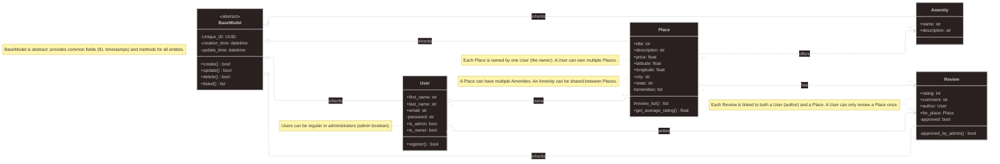

# holbertonschool-hbnb

```mermaid
---
config:
  theme: neo-dark
  layout: elk
---
classDiagram
direction LR

    class BaseModel {
        -Unique_ID: UUID
        -creation_time: datetime
        -update_time: datetime
        +create() bool
        +update() bool
        +delete() bool
        +listed() list

    }

    class User {
        +first_name: str
        +last_name: str
        +email: str
        -password: str
        +is_admin: bool
        +is_owner: bool
        +register() bool
    }

    class Place {
        +title: str
        +description: str
        +price: float
        +latitude: float
        +longitude: float
        +city: str
        +state: str
        #amenities: list
        #review_list() list
        +get_average_rating() float
    }

    class Amenity {
        +name: str
        +description: str
    }

    class Review {
        +rating: int
        +comment: str
        +author: User
        +for_place: Place
        -approved: bool
        -approved_by_admin() bool
    }

    <<abstract>> BaseModel

    BaseModel <|-- User : inherits
    BaseModel <|-- Place : inherits
    BaseModel <|-- Amenity : inherits
    BaseModel <|-- Review : inherits

    User "1" o-- "0..*" Place : owns
    Place "0..*" --> "0..*" Amenity : offers
    User "1" --> "0..*" Review : writes
    Place "1" --> "0..*" Review : has

    note for BaseModel "BaseModel is abstract: provides common fields (ID, timestamps) and methods for all entities."
    note for User "Users can be regular or administrators (admin boolean)."
    note for Place "Each Place is owned by one User (the owner). A User can own multiple Places."
    note for Place "A Place can have multiple Amenities. An Amenity can be shared between Places."
    note for Review "Each Review is linked to both a User (author) and a Place. A User can only review a Place once."
```
